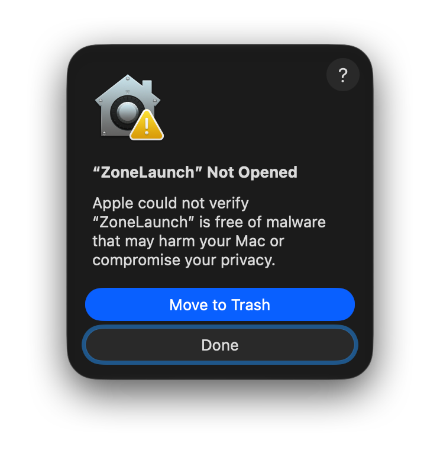
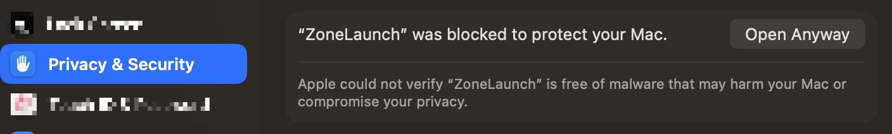

# Install ZoneLaunch from GitHub Releases

[Simplified Chinese](install-from-release.zh-CN.md)

Download a prebuilt **ZoneLaunch.app** without cloning the repo or installing Xcode tooling for day-to-day use.

> Builds are **ad-hoc signed** (no paid Apple Developer certificate, **not notarized**). That is intentional so the project stays free to ship. **First open is almost always blocked by macOS Gatekeeper** — this is expected, not a broken download.

## Download

1. Open the latest release:  
   **https://github.com/jawQ/app-timezone-launchers/releases/latest**
2. Download `ZoneLaunch-<version>-macos.zip` (the prebuilt app).  
   Ignore **Source code** zip/tar unless you want the full repository.
3. Optional: check the checksum against `SHA256SUMS` in the same release

## Install

```bash
# Example after downloading to ~/Downloads
cd ~/Downloads
unzip ZoneLaunch-*-macos.zip
# You should see ZoneLaunch.app
```

Then either:

- Drag **ZoneLaunch.app** into **Applications**, or
- Move it in Terminal:

```bash
rm -rf /Applications/ZoneLaunch.app
mv ZoneLaunch.app /Applications/
```

Do **not** expect a double-click to work on the first try after a Release download (see below).

## Why macOS blocks the first open

| Factor | What happens |
| --- | --- |
| Downloaded from the internet | macOS marks the file with a **quarantine** attribute |
| Ad-hoc signature only | Signed without a paid **Developer ID** certificate |
| Not notarized | Apple did not scan/approve this binary for Gatekeeper |

Gatekeeper then shows a dialog like the one below. Moving the app into **Applications** does **not** remove this block. Double-click or `open` will fail until you explicitly allow the app once.



This is the same class of warning many free open-source Mac apps get when they ship without a $99/year Apple Developer Program membership and notarization. **It is not proof of malware.**

## First open — recommended steps (matches current macOS UI)

### 1. Trigger the block once

Double-click **ZoneLaunch** (in Downloads or Applications). When the yellow-warning dialog appears (screenshot above), click **Done** (do **not** choose **Move to Trash**).

### 2. Allow it in System Settings

1. Open **System Settings** → **Privacy & Security**
2. Scroll to the security section. You should see a banner like the screenshot below.
3. Click **Open Anyway**
4. Confirm again if macOS asks



After that, ZoneLaunch opens normally on later launches.

### Alternative: right-click Open

In Finder: **Control-click** (or right-click) **ZoneLaunch** → **Open** → **Open**.  
On newer macOS versions this alone may not be enough; use **Open Anyway** above if the block dialog returns.

### Optional (advanced): clear quarantine in Terminal

Only if you trust the build (e.g. you verified `SHA256SUMS`):

```bash
xattr -dr com.apple.quarantine /Applications/ZoneLaunch.app
open /Applications/ZoneLaunch.app
```

## Will this go away in a future release?

Only if the project later ships with **Developer ID** signing + **notarization** (requires a paid Apple Developer account). Until then, the steps above remain the supported install path for Release zips.

## After upgrading

Starting with the first Sparkle-enabled release, ZoneLaunch checks for updates daily. When a newer release is available, a small blue update button appears in the main-window toolbar. Click it once to download the Ed25519-signed archive; after verification and installation, ZoneLaunch restarts automatically.

Users on an older build without the updater must replace `/Applications/ZoneLaunch.app` manually one last time. Prefer one install path only so you do not get two Dock icons.

If you previously installed from source with `./scripts/install-app.sh`, that script also cleans legacy Bundle IDs and duplicate registrations. For zip installs, removing the old app before moving the new one is enough in most cases.

## Requirements

- macOS 14 or later
- Bundle ID of official builds: `app.zonelaunch.launcher`

## Uninstall

```bash
rm -rf /Applications/ZoneLaunch.app
```

User configuration (time-zone groups, dropped apps) lives under:

```text
~/Library/Application Support/App Timezone Launcher/
```

Delete that folder only if you also want to wipe settings.

## Still prefer scripts?

Shell launchers remain the lightest path. See the [repository README](../../README.md).

## Build it yourself instead

See [Build from source](build-from-source.md).
